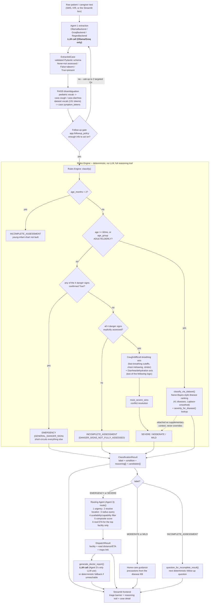
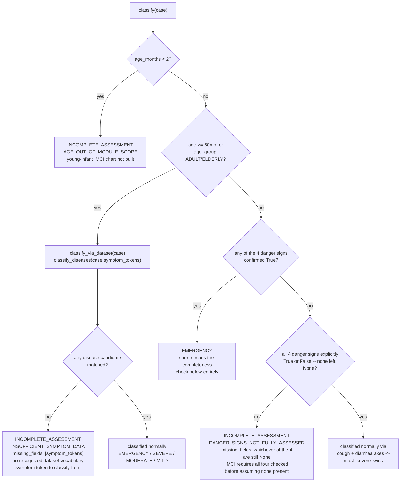
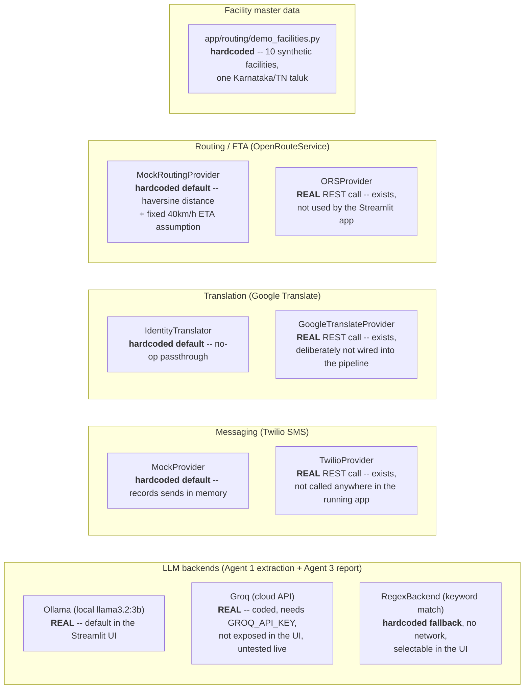

# Beyond Triage / Rural Health Triage POC

Status: **main workflow complete** -- Rules Engine + Agent 1 (extraction,
follow-up, disambiguation) + Routing Agent (Agent 3), all-ages coverage via
a dataset-driven disease classifier alongside the pediatric IMNCI engine.
Agent 2 (DBSCAN outbreak surveillance) is a separate, out-of-scope
side-track per project decision -- not built.

## System Architecture

Everything below is one process, in-memory, no message queue or network
hop between stages -- "Agent 1", "Rules Engine", "Routing Agent" are module
boundaries (`app/agent1_extraction.py`, `app/rules_engine.py`,
`app/routing/`), not separate services. The only two points anything
resembling "AI" runs are Agent 1's extraction call and Agent 3's optional
doctor-report call; every other box is plain deterministic Python,
auditable step by step via each result's own `reasoning` list.



Two age-routing decisions matter most for reading this diagram:
1. **Which classifier runs at all** -- pediatric IMNCI chart (2-60 months)
   vs. the dataset-driven disease classifier (everyone else). The dataset
   classifier's candidates are always computed when symptom tokens exist,
   but only *override* the label on the adult/elderly route -- on the
   pediatric route they ride along as supplementary context.
2. **Danger-sign short-circuit vs. completeness gate** -- a single
   confirmed `True` danger sign jumps straight to `EMERGENCY` without
   waiting to check the other three; only when *none* are confirmed `True`
   does "were all four actually asked?" become the safety-relevant
   question (`INCOMPLETE_ASSESSMENT` if not).

## Incomplete-Assessment Logic: how "not enough info" is decided

`INCOMPLETE_ASSESSMENT` is not a fallback for a low-confidence guess -- it's
a distinct, deliberate state (`app/schemas.py::ClassificationLabel`,
ranked outside the severity scale on purpose). The rule throughout this
codebase is: **a field the system never asked about (`None`) must never be
treated as "assessed and absent" (`False`)** -- so `classify()` refuses to
score an axis it doesn't have real data for, and says so explicitly
instead of silently assuming the safe-looking answer. There are exactly
three places this can fire, all inside `app/rules_engine.py::classify()`:



**The rule set, precisely:**

| # | Where | Rule | `condition` | `missing_fields` |
|---|---|---|---|---|
| 1 | `classify()`, before any routing | `age_months < 2` | `AGE_OUT_OF_MODULE_SCOPE` | (none -- out of scope, not a data gap) |
| 2 | `classify_via_dataset()` (age >=60mo or explicit adult/elderly) | `classify_diseases(case.symptom_tokens)` returns zero candidates | `INSUFFICIENT_SYMPTOM_DATA` | `["symptom_tokens"]` |
| 3 | `check_danger_sign_completeness()` (pediatric 2-60mo, only reached if no danger sign is already confirmed `True`) | `DangerSigns.missing_fields()` is non-empty -- i.e. at least one of the 4 general danger signs is `None` | `DANGER_SIGNS_NOT_FULLY_ASSESSED` | the specific `None` field(s) among `not_able_to_drink_or_breastfeed`, `vomits_everything`, `convulsions`, `lethargic_or_unconscious` |

Rule 3 only runs *after* rule "any danger sign `True` -> `EMERGENCY`" has
already had first say (see `classify_danger_signs()`) -- one confirmed
danger sign is already actionable and must not be delayed by asking about
the other three. Completeness only becomes the safety-relevant question
once the system is about to conclude "no danger signs" and needs to be
sure that's really true, not just unasked.

**Turning a gap into a question.** Once `missing_fields` is populated,
`app.agent1_extraction.question_for_incomplete_result(result)` looks up
the first missing field with a deterministic template (never LLM-generated
-- the question itself has to be auditable too):

| `missing_fields` entry | Question asked |
|---|---|
| `not_able_to_drink_or_breastfeed` | "Is the patient able to drink or breastfeed normally?" |
| `vomits_everything` | "Does the patient vomit up everything they eat or drink?" |
| `convulsions` | "Has the patient had any convulsions or fits during this illness?" |
| `lethargic_or_unconscious` | "Is the patient unusually sleepy, hard to wake, or unconscious?" |
| `symptom_tokens` | "What is the main problem? Please describe it in a few words (for example: fever, chest pain, vomiting, loose motions)." |

These five are the *only* things the system will ever say are "missing" --
exam-only signs (breathing rate, chest indrawing, skin pinch) are never
askable over text/SMS at all, so they're structurally excluded from
`missing_fields` rather than silently guessed at (see `app/schemas.py`'s
module docstring).

**Two different places this question gets used, and which one runs
today:**
- **Post-classification (what `streamlit_app.py` actually uses):**
  `classify()` runs once; if the result is `INCOMPLETE_ASSESSMENT`, the
  Doctor/ASHA tabs show the reasoning trail and
  `question_for_incomplete_result()`'s question as a hint. There is no
  automatic loop -- the caregiver's answer has to be added to the message
  box and "Assess" clicked again.
- **Pre-classification loop (built, not wired into the frontend):**
  `app.agent1_extraction.extract_case_with_followup()` asks up to
  `max_followup_turns` (default 2) questions *before* ever calling
  `classify()`, gated by the same rules via
  `app.followup_policy.missing_required()` -- but only for backends with
  `supports_followup = True` (Ollama, Groq); `RegexBackend` always falls
  through after one pass. This function exists and is tested
  (`tests/test_agent1_followup.py`, `tests/test_followup_scripts.py`) but
  the Streamlit app calls the simpler single-shot `extract_and_classify()`
  instead, not this loop.

## What's implemented

- `app/schemas.py` -- shared Pydantic schema between Agent 1 and the Rules
  Engine. Every clinical boolean is `Optional[bool] = None` ("not
  assessed") vs. `False` ("assessed, absent"), never conflated.
- `app/rules_engine.py` -- two routes, selected by age:
  - **Pediatric IMNCI** (2-60mo): danger-sign completeness gate
    (`INCOMPLETE_ASSESSMENT` as a distinct state), danger-sign
    classification (confirmed-True short-circuits to `EMERGENCY`),
    cough/difficult-breathing (age-based fast-breathing cutoffs, chest
    indrawing, stridor), diarrhea/dehydration (two-of-the-following
    logic), `most_severe_wins` conflict resolution. Young infant (<2mo)
    and malnutrition/anaemia charts are NOT yet built.
  - **Adult/elderly/out-of-band** (>=60mo, or age_group ADULT/ELDERLY):
    routed to the dataset-driven disease classifier as the primary
    signal (`classify_via_dataset`). In-band pediatric cases also get
    dataset candidates attached as *supplementary* context, never
    overriding the IMNCI label.
- `app/disease_kb.py` / `app/disease_classifier.py` -- knowledge base and
  Naive-Bayes-style probabilistic classifier built from
  `data/disease_symptoms.csv` (41 diseases, 131 symptom tokens, ~4920
  rows) and `data/disease_precautions.csv`. Laplace-smoothed so an unseen
  symptom doesn't zero out a candidate. A curated `DISEASE_SEVERITY` table
  maps each disease to an EMERGENCY/SEVERE/MODERATE/MILD tier. Handles the
  "3 candidates from different emergency situations" case by ranking on
  posterior probability, not first-match -- see
  `tests/test_disease_coverage.py` for the full 41-disease sweep (39/41
  top-1, 41/41 top-3; the two top-1 misses are a documented, real data
  ambiguity, not a bug).
- `app/agent1_extraction.py` -- pluggable `LLMBackend` (Ollama local /
  Groq cloud / Regex keyword fallback), single-shot (`extract_and_classify`)
  and multi-turn follow-up (`extract_and_classify_with_followup`)
  pipelines wiring raw text -> LLM -> validated schema -> Rules Engine.
- `app/disambiguation.py` -- FAISS symptom matching, TWO independent
  indexes: the original small pediatric-category vocabulary (feeds
  `case.cough`/`case.diarrhea` fallback) and a second index built from
  the full 131-token dataset vocabulary + curated Hindi/Hinglish aliases
  (feeds `case.symptom_tokens` for the disease classifier). Kept separate
  because some surface forms (e.g. "cough") exist in both vocabularies
  with different meanings.
- `app/followup_policy.py` -- minimum-viable-info follow-up gate: ask only
  what's genuinely missing and needed (pediatric: the four danger signs,
  unless one's already confirmed True; adult: any reported symptom text at
  all), never more -- a caregiver in an emergency has low patience.
  Two real entry points into the follow-up module: (A) Agent 1 ->
  follow-up module directly, PRE-classification (`extract_case_with_
  followup`'s loop, gated by this policy); (B) Rules Engine -> follow-up
  module, POST-classification (`agent1_extraction.question_for_
  incomplete_result`, driven by `classify()`'s own `INCOMPLETE_ASSESSMENT`
  + `missing_fields`) -- for a single-shot caller that classifies first
  and decides whether to ask afterward. Both flows are proven to agree on
  which question to ask for the same gap (`tests/test_two_followup_flows.py`).
- `app/case_store.py` -- SQLite previous-calls/area log (opt-in via
  `extract_and_classify_with_followup(..., case_store=...)`), for
  same-area case correlation; stores a hash of raw text, never the text
  itself.
- `app/routing/` -- Routing Agent (Agent 3): deterministic 6-step core
  (`facility_db.py`, `router.py` -- radius query, availability/capability
  filtering, composite scoring, route/ETA) plus an LLM doctor-report layer
  on top (`report.py`, with a non-LLM fallback when the backend is
  unreachable).
- `app/integrations/` -- pluggable external adapters, offline-mock default
  for every one: `messaging.py` (Twilio SMS), `translation.py` (Google
  Translate), `geo.py` (OpenRouteService + Google Maps links). All via
  plain HTTP (`requests`), no extra SDK dependency. See "External
  Integrations" below for exactly what's real vs. hardcoded/mocked.
- `streamlit_app.py` -- health-officer-facing frontend: symptom input,
  full case/classification detail, clinical reasoning trail, disease
  candidates, and (for EMERGENCY/SEVERE cases) a facility routing +
  doctor-handoff report panel. Routes against a **hardcoded synthetic
  facility network** (`app/routing/demo_facilities.py`) -- see below.

## External Integrations: implemented vs. hardcoded

Every external integration point in this repo follows the same pattern:
a real adapter that actually calls the third-party API exists, but the
pipeline's **default is an offline mock/hardcoded stand-in**, so the whole
system runs with no network access and no API keys. Nothing below is
silently faked as "real" -- each result carries which one actually ran
(e.g. `RouteInfo.provider`, `ExtractedCase.llm_backend`).



| Integration | Real adapter | What actually runs today | Notes |
|---|---|---|---|
| Ollama (local LLM) | `OllamaBackend` | **Real** -- default backend in `streamlit_app.py`, real HTTP to a local `ollama serve` | Needs Ollama running locally with `llama3.2:3b` pulled; the app shows a clear error if it isn't reachable |
| Groq (cloud LLM) | `GroqBackend` | **Real** code path, but inert without `GROQ_API_KEY`; not offered as a choice in the Streamlit sidebar | Untested live end-to-end (no key configured in this environment) |
| Keyword extractor | `RegexBackend` | **Hardcoded** deterministic keyword table, no network | The SMS/USSD low-connectivity tier; selectable in the UI as "Offline keyword matcher" |
| Twilio SMS | `TwilioProvider` | **Not used** -- `MockProvider` (records to an in-memory list, never sends) is the only one ever constructed anywhere in the app | `TwilioProvider.send_message()` genuinely works against Twilio's REST API if a caller constructs it with credentials, but no caller does |
| Google Translate | `GoogleTranslateProvider` | **Not used** -- no translator is even constructed in the current pipeline (`IdentityTranslator`'s no-op behavior is what you'd get if one were) | Deliberate: Ollama/Groq already read Hindi/Tamil/English directly, and FAISS disambiguation is already multilingual, so nothing currently calls this adapter |
| OpenRouteService | `ORSProvider` | **Not used** -- `route()`'s default and the Streamlit app both use `MockRoutingProvider` (straight-line haversine distance, 40km/h assumed average speed) | `ORSProvider` genuinely calls the real ORS Directions API if a caller passes `ORSProvider(api_key=...)` into `route()`; the frontend never does |
| Facility database | `FacilityDB` (SQLite) | **Hardcoded demo data** -- 10 fabricated facilities across 5 villages in one Karnataka/Tamil Nadu taluk (`app/routing/demo_facilities.py`) | The storage/query layer (`facility_db.py`) is real and production-shaped; no real facility ingestion has happened yet |
| SMS/IVR inbound replies | -- | **Not implemented at all** | `answer_provider` (the follow-up loop's "ask a question, get an answer" seam) is a scripted callback in tests, not a real "send via Twilio, block on the next inbound webhook" session-store layer |

## Planned vs. Actual Architecture

The original project plan describes a broader end-to-end system (patient
reaches in over SMS/voice/USSD, ASHA-worker and 108-ambulance dispatch, a
surveillance Agent 2) than what this repo currently builds. Gap analysis
against that plan:

| Diagram element | Reality |
|---|---|
| Patient sends via SMS/voice/USSD | Not built -- only text input (Streamlit box / `demo.py`), no real SMS/IVR channel |
| LLM Agent 1 parses input | Built (`OllamaBackend`/`GroqBackend`/`RegexBackend`) |
| Field missing? -&gt; Follow-up SMS | Follow-up loop exists (up to 2 Qs), but it's not sent over real SMS -- no Twilio wiring, no inbound-reply/session-store layer |
| IMNCI rules engine | Built, but only pediatric 2-60mo + a separate adult/elderly dataset classifier (not part of this diagram at all) |
| 3-way split: Non-urgent / Urgent / Emergency | Actual output is 5 tiers: MILD / MODERATE / SEVERE / EMERGENCY / INCOMPLETE_ASSESSMENT |
| Home care SMS | Guidance text is generated, never sent as SMS (no messaging wired in) |
| ASHA worker alerted | Not implemented -- no ASHA-worker concept anywhere in code |
| Routing agent (PHC DB, capability score, road distance) | Built (6-step deterministic), but "road distance" is a haversine estimate by default -- real OpenRouteService (`ORSProvider`) exists but isn't wired in |
| 108 ambulance / ASHA SMS alert / Doctor pre-arrival (3 dispatch branches) | Not built -- only one output: a single doctor-handoff report (text), no ambulance dispatch, no ASHA SMS, no real messaging to anyone |
| Health officer dashboard | Built (`streamlit_app.py`), but a single-case triage view -- no case map, no aggregated alerts |
| LLM Agent 2 -- DBSCAN outbreak surveillance | Explicitly out of scope / not built (documented as a separate side-track) |

**Bottom line:** extraction -&gt; rules engine -&gt; routing/report is real and
working; everything involving real SMS/voice channels, ASHA/108 dispatch,
and outbreak surveillance (Agent 2) is either mocked or missing.

## What's explicitly NOT implemented yet

- Young infant (0-<2mo) and malnutrition/anaemia IMCI charts.
- Degradation Controller / automatic backend selection. Backend choice is
  currently manual (caller passes a backend instance).
- Agent 2 (DBSCAN outbreak surveillance) -- separate side-track, out of
  scope for the main workflow per project decision.
- Real facility ingestion pipeline -- the routing demo runs entirely
  against the hardcoded synthetic dataset above, not real PHC/CHC/DH data.
- Real SMS/IVR session-store/webhook layer -- `answer_provider` and
  `MessagingProvider.send_message()` are both real, working seams, but the
  "send a question, block on the next inbound message" infrastructure
  connecting them doesn't exist yet.
- Groq backend is untested live -- no `GROQ_API_KEY` is configured in this
  environment.
- The pediatric-category FAISS threshold (`DEFAULT_CONFIDENCE_THRESHOLD`,
  0.65) is explicitly flagged uncalibrated -- no labelled sample exists
  for that small 2-category vocabulary yet.
- The dataset-vocabulary FAISS threshold
  (`DEFAULT_DATASET_CONFIDENCE_THRESHOLD`) IS calibrated:
  `app.disambiguation.calibrate_dataset_threshold()` is a real, reusable
  sweep function, run against the 80-item labelled
  `tests/fixtures/symptom_calibration.py` sample. Its output (0.45, 97.5%
  accuracy, up from 93.8% at a hand-picked 0.65) is the shipped default --
  `tests/test_calibration.py` asserts the shipped value actually matches
  what the calibration function computes, so the two can't silently drift
  apart.

## Known limitations (documented, not silently fixed)

- `llama3.2:3b` via Ollama reliably extracts *positive* danger signs
  (convulsions=True, lethargic=True) but is inconsistent extracting
  *negative* ones (explicit denials sometimes come back `None` instead of
  `False`), especially in longer, multi-fact messages. See the `xfail` in
  `tests/test_integration_agent1_pipeline.py`.
- The dataset symptom-token FAISS index correctly handles native-script
  Hindi and Hinglish cough phrasing, but a specific class of romanized
  diarrhea phrasing gets misrouted. See the `xfail` in
  `tests/test_disambiguation.py`.
- Two disease pairs in the underlying CSV are genuinely symptom-similar
  (Hepatitis D/E; Heart attack/Tuberculosis) -- the probabilistic
  classifier's top-1 pick isn't always correct for these two, though the
  correct disease always appears in the top 3. See
  `tests/test_disease_coverage.py`.

## Running tests

```
cd triage-poc
./.venv/bin/python -m pytest tests/ -v
```

The integration tests (and the live-Ollama parts of the follow-up-loop
tests) require `ollama serve` running locally with `llama3.2:3b` pulled;
they auto-skip if Ollama isn't reachable. `tests/test_integrations.py`
mocks every HTTP call for the Twilio/Google Translate/OpenRouteService
adapters -- no real network or API keys needed to run the suite.
