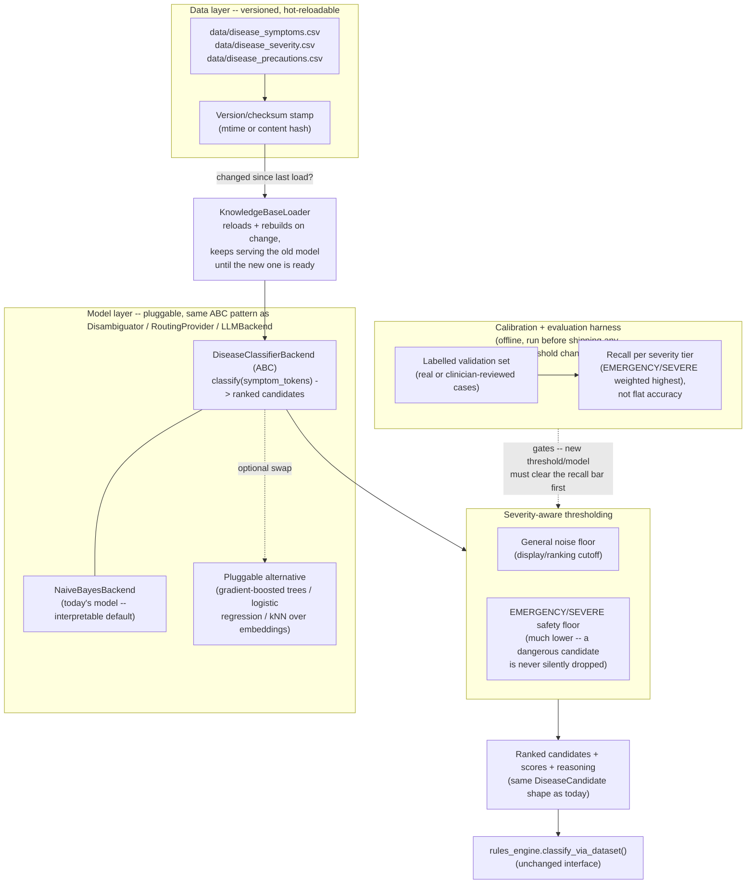

# Rule Engine Design: Dynamic, Probabilistic, Recall-First

This is a design proposal, not a description of shipped code. It covers
the CSV-driven half of `app/rules_engine.py` -- specifically
`app/disease_classifier.py`'s `classify_via_dataset()` path, which handles
every adult/elderly/out-of-band case (see `README.md`'s architecture
diagram). The pediatric IMNCI half of the rules engine is fixed clinical
logic (WHO's own chart) and is intentionally *not* in scope for
"make it dynamic/ML-driven" -- that would mean second-guessing a validated
external clinical standard, which is a different, much higher-stakes
decision than anything below.

## 1. What exists today, and why it's not enough

`app/disease_classifier.py` already is a probabilistic model: a Naive-Bayes
posterior over 41 diseases, estimated once at process start from
`data/disease_symptoms.csv`'s ~4920 rows, Laplace-smoothed, ranked and
returned with per-candidate scores. That part of the ask is already true.

What's missing, precisely:

1. **Static, not dynamic.** `get_default_classifier()` is a module-level
   singleton built once, from one hardcoded file path, at first call.
   Updating the disease/symptom data means editing the CSV *and*
   restarting the process -- there's no reload, no versioning, no way to
   ship a data update independently of a code deploy.
2. **One global noise floor, not severity-aware.** `MIN_CANDIDATE_SCORE =
   0.01` drops any candidate below 1% posterior share -- uniformly, for
   every disease. A rare-presentation EMERGENCY-tier disease with a
   genuinely low posterior (because its symptom combination is uncommon in
   the training rows) gets filtered out exactly like a genuinely
   irrelevant MILD-tier one. That's backwards for a triage system: the
   cost of silently dropping a dangerous candidate is not the same as the
   cost of dropping a harmless one.
3. **No optimization target.** Nothing in the current pipeline measures or
   optimizes for false negatives specifically. `tests/test_disease_coverage.py`
   checks top-1/top-3 accuracy across all 41 diseases equally-weighted --
   a useful correctness test, but it does not answer "how often does the
   system fail to surface a dangerous disease at all," which is the
   question that actually matters for triage safety.
4. **No calibration or retraining process.** Contrast this with
   `app/disambiguation.py`'s FAISS threshold, which *does* have a real,
   reusable calibration function (`calibrate_dataset_threshold()`) run
   against a labelled sample (`tests/fixtures/symptom_calibration.py`),
   with a test (`tests/test_calibration.py`) asserting the shipped default
   matches what calibration actually computes. `disease_classifier.py` has
   no equivalent -- `MIN_CANDIDATE_SCORE` is a bare, undocumented-as-such
   guess.

## 2. Design goals, stated as targets, not slogans

- **Dynamic**: the disease/symptom knowledge base (and the model fit to
  it) can be updated -- new rows, new diseases, corrected severity -- and
  picked up by the running system without a code change or a full
  redeploy.
- **Probabilistic / ML-based**: keep a real statistical model producing a
  score per candidate (already true), but make the model itself a
  swappable component, not one hardcoded algorithm, so a better model can
  replace Naive Bayes later without touching `rules_engine.py`.
- **Recall-first, severity-weighted**: the system should be tuned to
  minimize **false negatives on dangerous diseases** specifically, even at
  the cost of more false positives / more candidates shown. Missing a
  case of a EMERGENCY-tier disease is a materially worse failure than
  over-flagging a MILD-tier one, and the design should say so explicitly
  rather than optimizing one flat accuracy number.
- **Still auditable.** Every existing safety property stays: a
  `reasoning`/`matched_symptoms` trail per candidate, no silent guessing,
  same "no black-box scoring outside the two LLM agents" rule the rest of
  this codebase already follows (see `README.md`'s Known Limitations).

## 3. Proposed architecture



### 3.1 Data layer: make the CSV a live input, not a build-time constant

- Keep CSV as the source format (already the right call --
  `app/disease_kb.py`'s own docstring explains why severity is a plain
  editable file rather than buried in Python: "anyone with real clinical
  severity data can replace it and nothing in the code needs to change").
  Extend that same philosophy to the symptom/disease data itself.
- Add a version stamp: file mtime or a content hash, checked cheaply on
  each `get_default_classifier()` call (or on a timer/webhook in a real
  deployment). On change, rebuild the model in the background and swap
  the singleton reference atomically -- in-flight requests keep using the
  old model until the new one is ready, never a half-built one.
- This is the same "swap the data file, no code change" property
  `disease_severity.csv` already has -- the gap is only that
  `disease_symptoms.csv` doesn't get re-read after process start.

### 3.2 Model layer: keep Naive Bayes, but behind a real seam

This codebase already has a consistent pattern for "one interface, an
offline-safe default implementation, and a real one swapped in by the
caller": `Disambiguator`/`FAISSDisambiguator`, `RoutingProvider`/
`ORSProvider`, `LLMBackend`'s three backends, `Translator`/
`GoogleTranslateProvider`. `disease_classifier.py` should get the same
treatment instead of being one concrete class:

```
class DiseaseClassifierBackend(ABC):
    def classify(self, symptom_tokens: list[str]) -> list[DiseaseCandidate]: ...

class NaiveBayesBackend(DiseaseClassifierBackend):
    # today's model, kept as the shipped default -- interpretable,
    # auditable, no training infrastructure required.

# a later, optional addition -- NOT required to ship the dynamic/
# recall-first goals above, which apply equally to Naive Bayes itself:
class GradientBoostedBackend(DiseaseClassifierBackend): ...
```

Why keep Naive Bayes as the *default*, not replace it: it's already
correctly probabilistic, it's cheap to retrain (closed-form counts, no
gradient descent, no training instability), and -- critically for a
clinical-adjacent system -- every score it produces decomposes into
"which symptom contributed how much," which a boosted-tree or neural
model does not give you for free. A more powerful model is a legitimate
future upgrade *if the calibration harness in 3.4 shows it actually
improves recall on dangerous diseases* -- not a default assumption that
more complex means better here.

### 3.3 Severity-aware thresholding (the direct fix for false negatives)

Replace the single `MIN_CANDIDATE_SCORE` with two floors:

- **Display/noise floor** (today's `0.01`): keeps the general candidate
  list free of statistical noise for MODERATE/MILD-tier diseases.
- **Safety floor**, much lower, applied only to candidates whose
  `severity_for_disease()` result is EMERGENCY or SEVERE: a dangerous
  disease with a low-but-nonzero posterior is still surfaced (flagged
  distinctly, e.g. "low-confidence but high-severity — do not rule out")
  rather than silently dropped for being statistically unlikely. This is
  the direct, mechanical answer to "ensure true positives / minimize
  false negatives": the threshold itself is asymmetric by clinical
  consequence, not just by statistical confidence.
- Both floors stay in `reasoning` as named, cited constants (per this
  codebase's existing "no unexplained magic number" convention), not
  buried literals.

### 3.4 Calibration + evaluation harness (the part that's currently missing entirely)

Mirror `app.disambiguation.calibrate_dataset_threshold()` and its labelled
fixture (`tests/fixtures/symptom_calibration.py`) exactly, but score a
different metric:

- Build a labelled validation set: real or clinician-reviewed
  `(symptom_tokens -> correct disease)` cases, ideally including
  hard/ambiguous ones (the existing Hepatitis D/E and Heart
  attack/Tuberculosis pairs flagged in `README.md`'s Known Limitations
  are exactly the right kind of case to include).
- The metric to optimize is **recall per severity tier**, weighted so
  EMERGENCY misses count far more than MILD misses -- e.g. report
  `recall(EMERGENCY)`, `recall(SEVERE)`, `recall(MODERATE)`,
  `recall(MILD)` separately, and gate any threshold/model change on the
  EMERGENCY/SEVERE numbers specifically, not an aggregate.
- Run this harness the same way `tests/test_calibration.py` asserts the
  shipped FAISS threshold matches what calibration computes: a test that
  fails if someone hand-edits `MIN_CANDIDATE_SCORE` or the safety floor
  without re-running calibration, so the two can't silently drift apart.
- Re-run whenever `data/disease_symptoms.csv` or `data/disease_severity.csv`
  changes materially (ties back into 3.1's version stamp) -- a data update
  should re-trigger calibration, not just a reload.

## 4. What changes for `rules_engine.py`, and what doesn't

`app/rules_engine.py::classify_via_dataset()` keeps calling
`get_default_classifier().classify_diseases(...)` and reading
`severity_for_disease()` exactly as today -- the interface (`list[DiseaseCandidate]`,
`ClassificationResult.candidates`/`probable_disease`) is unchanged. Every
change above is internal to `disease_classifier.py`: which concrete
backend answers the call, how often its data reloads, and where the
score cutoff sits. That's deliberate -- it's the same "swap the seam, not
the caller" shape every other pluggable component in this codebase
already uses, so this fits the existing architecture rather than
introducing a new pattern.

## 5. Sequencing (do these in order, not all at once)

1. Ship the severity-aware safety floor (3.3) first -- it's a small,
   low-risk change with an immediate, directly-arguable recall benefit,
   and needs no new infrastructure.
2. Build the calibration + recall-per-tier harness (3.4) -- without this,
   any later model change is unvalidated by definition.
3. Add the version-stamped reload (3.1) once there's an actual process for
   updating the CSVs outside a code deploy (no point building hot-reload
   for a file that in practice only ever changes via `git pull`).
4. Only then consider a second `DiseaseClassifierBackend` (3.2) -- and
   only if the harness from step 2 shows it beats Naive Bayes on
   EMERGENCY/SEVERE recall specifically, not on overall accuracy.
