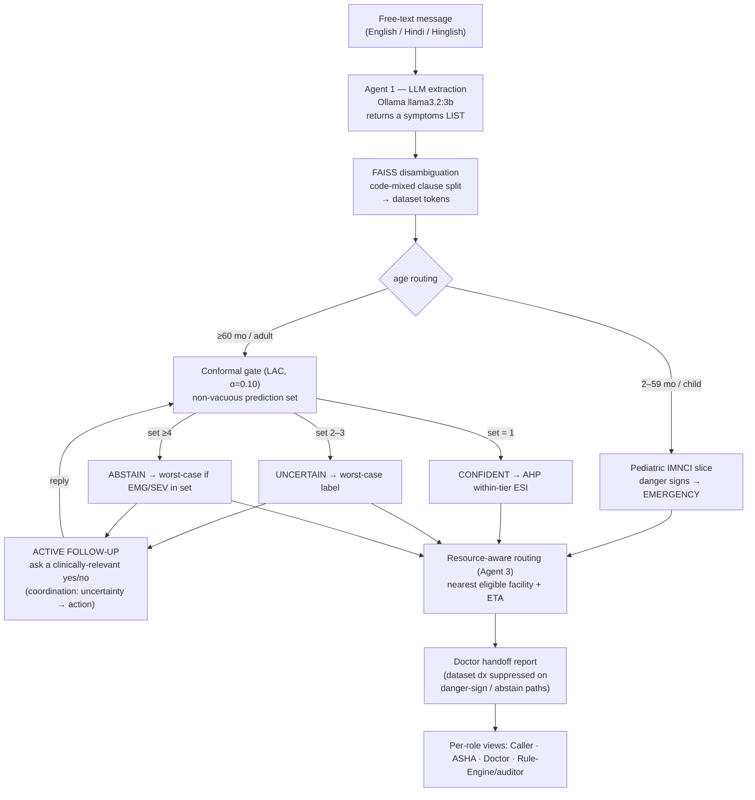

# Beyond Triage — Paper Evidence Map (Stage 7)

> Assembles the implementation into paper-ready form: every claim the paper makes
> is mapped to the code mechanism that implements it and the evaluation that
> proves it, with a final logicality pass confirming no claim outruns the code.
> Grounded against the `9th-october` tree after Stages 0–6. Code is authoritative;
> see `CODEBASE_CONTEXT.md` for the verified internals and `triage-poc/rule_engine_design_final.md`
> for the primary design reference.

## 1. USP and scope-of-claims contract

**USP:** the *end-to-end agentic workflow* and the *coordination within and between
modules* for one use case — CHW-assisted triage in low-resource settings, framed
under UN SDG-3. The contribution is a software/CS framework: how free-text
extraction, a safety-calibrated abstain decision, urgency prioritization, and
resource-aware routing are **coordinated**, with *active follow-up* as the
mechanism that links uncertainty to action. It is **not** a claim about the
rule-engine model internals or the specific models (which are standard,
interpretable, defensible choices — confirmed by the out-of-sample bake-off).

**We claim:** (1) framework/coordination correctness; (2) selective-prediction
safety properties (abstain-and-ask, near-zero under-triage); (3) robustness to
language variation. **We do not claim** clinical diagnostic accuracy — stated as a
limitation and future work. Every mechanism below is made true in code (or
reframed honestly) before the paper claims it.

### The four computational problems (paper spine)
1. robust free-text → structured extraction under language variation;
2. classification with a safety-calibrated **abstain** decision;
3. urgency prioritization;
4. resource-aware routing;

with **active follow-up** as the mechanism that links uncertainty (2) to action.

## 2. Workflow & coordination (the USP, diagrammed)



The arrows **Q → E** (follow-up re-enters classification) and the worst-case /
danger-sign escalation across every branch are the inter-module coordination the
paper is about: no single module decides safety alone.

## 3. Claims → code → evidence

| Claim | Code mechanism | Evidence / metric |
|---|---|---|
| **(i) Robust extraction under language variation** | `agent1_extraction`: `symptoms` LIST contract + `_normalize_symptom_fields`; `_SYMPTOM_CLAUSE_SPLIT` code-mixed conjunctions (aur/और/…) | `tests/test_extraction_coverage.py` (22): MI → {chest_pain, sweating, breathlessness, vomiting}; "pet dard aur ulti" → {stomach_pain, vomiting}. Live-verified on 3B. |
| **(ii) Safety-calibrated abstain** (CP non-vacuous) | `disease_classifier.classify_with_cp`: split conformal / LAC on the emergency-boosted NB posterior, α=0.10, q̂≈0.022 | `tests/test_cp_calibration.py` (7): q̂<1; set shrinks with evidence (6→3→2); posteriors non-degenerate; ECE≈0/Brier≈0.009 reported. |
| **Does not miss emergencies** (near-zero under-triage) | `rules_engine`: worst-case severity on UNCERTAIN/ABSTAIN-with-EMG/SEV; `_apply_danger_sign_override` across all adult CP decisions; F1 emergency set-inclusion | `tests/test_safety_guardrail.py` (43, build-failing); **OOS short-message under-triage = 0.0 (0/142)** vs flat-threshold baseline 6.3% (`evaluate_oos.py`, `test_eval_harness.py`). |
| **Asks, not guesses** (uncertainty → a relevant question) | `followup_question_selector`: `_relevant_tokens` constrains to clinically-characteristic discriminators; `agent1_extraction` Flow C loop | `tests/test_stage4_followup_ahp_report.py`: cough+fever → asks about phlegm (not exertional HR). OOS ask-or-abstain rate 33.9%. |
| **(iii) Urgency prioritization** | `emergency_scorer` AHP: within-tier ESI prioritizer (not a label); onset-acuity word-boundary fix | `tests/test_stage4_followup_ahp_report.py`: onset fix; danger-sign → ESI-1; AHP never sets the label. |
| **(iv) Resource-aware routing** | `routing/router.route`: eligibility filter + haversine scoring | `tests/test_routing_fixtures.py`: router selects the scored-optimal eligible facility (≈100% vs brute-force worked example). |
| **Reliable despite LLM / language** | token-order / paraphrase invariance in the pipeline | OOS consistency = 1.0 (`evaluate_oos.py`). |
| **Safe doctor handoff** | `routing/report._dataset_diagnosis_is_primary` gates the dataset dx | `tests/test_stage4_followup_ahp_report.py`: convulsing-infant report omits "Cervical spondylosis / heating pad". |

On **F1 = 1.00**: reported once as an *internal-consistency / pipeline-wiring check*
on full in-sample rows, never as a headline result. The headline is the
out-of-sample + short-message table above, where numbers are imperfect (over-triage
21.6%) and therefore believable.

## 4. Logicality pass — claims that would not have survived review, now resolved

| Prior risk (plan §6) | Status after Stages 0–6 |
|---|---|
| "CP gives distribution-free ≥95% coverage" but q̂=1.0 → vacuous | FIXED (Stage 3): LAC gate, q̂≈0.022, set shrinks with evidence; coverage reported honestly (α=0.10 nominal 90%, empirical ~99%). |
| "A τ/δ reject option decides when to abstain" but it is never called | FIXED (Stage 3): the dead `classify_with_abstention` τ/δ path is removed; conformal is the sole gate. |
| "Calibrated posterior probabilities" but isotonic collapses to 0.000 | FIXED (Stage 3): displayed posteriors are the real (boosted) NB probabilities; isotonic backs only the reported top-1 confidence + ECE/Brier. |
| "AHP multi-criteria scoring prioritizes urgency" but AHP doesn't change the label | REFRAMED (Stage 4): AHP is a *within-tier ESI prioritizer*, explicitly not the triage label — documented and tested. |
| "Worst-case severity protects against under-triage" but only for 2–3 sets | FIXED (Stage 2): extended to ABSTAIN-with-EMG/SEV; guardrail proves 0 under-triage. |
| "Follow-up asks the most informative question" but questions were clinically incoherent | FIXED (Stage 4): candidate tokens constrained to characteristic discriminators of the differential. |
| UI captions claim τ/δ / isotonic posteriors | FIXED (Stage 6): Rule Engine captions rewritten; held-out evaluation view added. |

### Mechanism-honesty checklist (all ✓)
- Conformal gate is **non-vacuous** (q̂ < 1, set varies by input).
- **No dead** τ/δ reject path.
- **AHP has a defined role** (within-tier ESI prioritization, not labelling).
- Displayed **posteriors are meaningful** (not 0.000).
- The disease knowledge base is described as a **Kaggle-style 41-disease dataset**,
  and the pediatric path as a **small hand-coded IMNCI danger-sign slice** — NOT a
  full IMNCI implementation (see §5).

## 5. Limitations & future work

**Stated limitations** (do not overstate): (L1) in-sample evals test the training
distribution; the OOS harness mitigates this but the data is still the Kaggle
dataset. (L2) only 2 EMERGENCY diseases in the dataset — emergency recall does not
generalize to conditions absent from the CSV. (L4) Agent-1 extraction error is not
folded into the OOS numbers (those score tokens directly); it is a separate,
unmeasured source of error. (L6) "No" answers add no negative evidence. (`disease_severity.csv`
has no documented clinical provenance.) The system makes **no clinical
diagnostic-accuracy claim**.

**Future work (named in the paper, not built):** Agent 2 (DBSCAN outbreak
surveillance / RAG); real SMS/IVR channel; graceful LLM degradation / backend
failover; speed optimization; clinical validation (anchor severities to ESI or a
clinician sign-off); real road routing (ORS); full IMNCI ingestion (ear /
malaria / nutrition axes, young-infant ruleset); folding Agent-1 extraction error
into the end-to-end metric.

## 6. Reproducing the results

```bash
cd triage-poc
python -m venv .venv && ./.venv/bin/pip install -r requirements.txt   # Python 3.11
PYTHONPATH=. ./.venv/bin/python tests/evaluate_oos.py                  # headline OOS table
./.venv/bin/python -m pytest tests -q                                  # full suite (CI mirrors this)
./.venv/bin/python -m streamlit run streamlit_app.py                   # UI + evaluation view
```

Out-of-sample baseline figures live in `tests/eval_oos_results.json`
(regenerate the tracked copy with `tests/evaluate_oos.py --write`). The in-sample
sanity-check evals are `tests/evaluate_{100_cases,balanced,1000}.py`.
