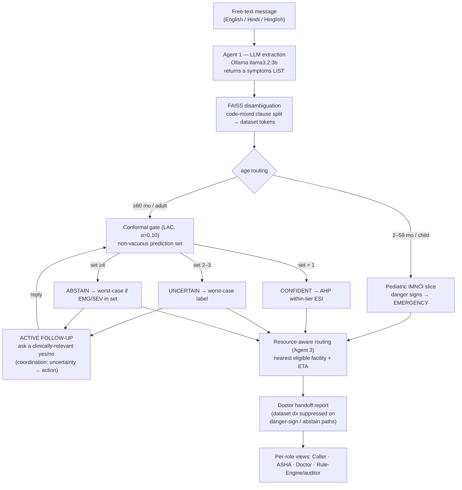

# Beyond Triage — Paper Evidence Map (Stage 7)

> Assembles the implementation into paper-ready form: every claim the paper makes
> is mapped to the code mechanism that implements it and the evaluation that
> proves it, with a final logicality pass confirming no claim outruns the code.
> Grounded against the `9th-october` tree after Stages 0–6. Code is authoritative;
> see `CODEBASE_CONTEXT.md` for the verified internals and `triage-poc/rule_engine_design_final.md`
> for the primary design reference.

## 1. USP and scope-of-claims contract

**USP:** the *end-to-end agentic workflow* and the *coordination within and between
modules* for one use case — CHW-assisted triage in low-resource settings, framed
under UN SDG-3. The contribution is a software/CS framework: how free-text
extraction, a safety-calibrated abstain decision, urgency prioritization, and
resource-aware routing are **coordinated**, with *active follow-up* as the
mechanism that links uncertainty to action. It is **not** a claim about the
rule-engine model internals or the specific models (which are standard,
interpretable, defensible choices — confirmed by the out-of-sample bake-off).

**We claim:** (1) framework/coordination correctness; (2) selective-prediction
safety properties (abstain-and-ask, near-zero under-triage); (3) robustness to
language variation. **We do not claim** clinical diagnostic accuracy — stated as a
limitation and future work. Every mechanism below is made true in code (or
reframed honestly) before the paper claims it.

### The four computational problems (paper spine)
1. robust free-text → structured extraction under language variation;
2. classification with a safety-calibrated **abstain** decision;
3. urgency prioritization;
4. resource-aware routing;

with **active follow-up** as the mechanism that links uncertainty (2) to action.

## 2. Workflow & coordination (the USP, diagrammed)



The arrows **Q → E** (follow-up re-enters classification) and the worst-case /
danger-sign escalation across every branch are the inter-module coordination the
paper is about: no single module decides safety alone.

## 3. Claims → code → evidence

| Claim | Code mechanism | Evidence / metric |
|---|---|---|
| **(i) Robust extraction under language variation** | `agent1_extraction`: `symptoms` LIST contract + `_normalize_symptom_fields`; `_SYMPTOM_CLAUSE_SPLIT` code-mixed conjunctions (aur/और/…) | `tests/test_extraction_coverage.py` (22): MI → {chest_pain, sweating, breathlessness, vomiting}; "pet dard aur ulti" → {stomach_pain, vomiting}. **Quantified (§3.4):** on the labelled Hindi/Hinglish/English fixture, schema-valid 86.7%, expected-token recall 80.0%, failure 13.3%. |
| **(ii) Safety-calibrated abstain** (CP non-vacuous) | `disease_classifier.classify_with_cp`: split conformal / LAC on the emergency-boosted NB posterior, α=0.10, q̂≈0.022 | `tests/test_cp_calibration.py` (7): q̂<1; set shrinks with evidence (6→3→2); posteriors non-degenerate; ECE≈0/Brier≈0.009 reported. |
| **Does not miss emergencies** (under-triage bounded by α) | `rules_engine`: worst-case severity on UNCERTAIN/ABSTAIN-with-EMG/SEV; `_apply_danger_sign_override` across all adult CP decisions | `tests/test_safety_guardrail.py` (43, build-failing); **OOS short-message under-triage = 0.0 (0/142)**, vs **9.2%** for an independent NB top-1 baseline and **6.3%** when worst-case labelling is ablated (`evaluate_oos.py`, `test_eval_harness.py`). See §3.1 — this is a *design guarantee*, not an empirical discovery. |
| **Asks, not guesses** (uncertainty → a relevant question) | `followup_question_selector`: `_relevant_tokens` constrains to clinically-characteristic discriminators; `agent1_extraction` Flow C loop | `tests/test_stage4_followup_ahp_report.py`: cough+fever → asks about phlegm (not exertional HR). OOS ask-or-abstain rate 33.9%. **Quantified in §3.3** — with absence-aware scoring the loop resolves **71.8%** of uncertain cases in 2.18 questions and cuts over-triage 21.6% → 4.9%. |
| **(iii) Urgency prioritization** | `emergency_scorer` AHP: within-tier ESI prioritizer (not a label); weights, λmax and CR **derived from the pairwise matrix at import** (`_derive_ahp_weights`, power iteration) rather than transcribed | `tests/test_cp_ahp_adaptive.py`: weights equal the principal eigenvector; CR = **0.0198** computed (the previously quoted 0.0205 was not reproducible); CR < 0.10 enforced at import; danger-sign → ESI-1; AHP never sets the label. |
| **(iv) Resource-aware routing** | `routing/router.route`: eligibility filter + haversine scoring | `tests/test_routing_fixtures.py`: router selects the scored-optimal eligible facility (≈100% vs brute-force worked example). |
| **Robust to which symptoms get mentioned** | bag-of-token scoring + worst-case set labelling | OOS **subset robustness = 86.6%** over 277 profiles (`evaluate_oos.py`): two different 2–4 symptom subsets of the same patient agree on the tier. Honest, imperfect, and therefore informative. |
| **Safe doctor handoff** | `routing/report._dataset_diagnosis_is_primary` gates the dataset dx | `tests/test_stage4_followup_ahp_report.py`: convulsing-infant report omits "Cervical spondylosis / heating pad". |

On **F1 = 1.00**: **not reported in the paper at any point.** It is produced by the
legacy in-sample scripts (`evaluate_{100_cases,balanced,1000}.py`) scoring full
symptom rows drawn from the very data the Naive Bayes was fit on, so a perfect
score is a property of the setup rather than of the system. Those scripts are
retained **only as regression tests for pipeline wiring**. Every number the paper
quotes comes from `evaluate_oos.py`.

## 3.1 The under-triage result is a guarantee, not a measurement

This distinction decides whether the central claim survives review, so it is
stated explicitly rather than left for a reader to discover.

The framework labels a multi-disease prediction set with the **worst-case
(most severe) tier in that set**. If the true disease lies inside the set, the
surfaced tier is therefore at least as severe as the truth, and under-triage is
impossible. Under-triage can only occur when the conformal set *misses* the
truth, which split conformal prediction bounds:

> **Property.** With a conformal set `S(x)` of marginal coverage ≥ 1 − α and
> worst-case-tier labelling over `S(x)`:
> `P(under-triage) ≤ P(y ∉ S(x)) ≤ α`.

So "0/142 under-triage" is **entailed by** the measured coverage of 1.0 — it is
not independent evidence. Presented correctly, this is *stronger* than an
empirical zero: it is a distribution-free safety bound that holds by
construction, tunable through α. What the harness measures empirically is the
**premise** (coverage) and the **price** (over-triage 21.6%).

### Ablations and baseline (same held-out short messages, `evaluate_oos.py`)

| system | boost | CP set | worst-case | under-triage | over-triage | confident |
|---|:--:|:--:|:--:|---|---|---|
| **full_system** | ✓ | ✓ | ✓ | **0.0%** | 21.6% | 66.1% |
| ablation_no_emergency_boost | – | ✓ | ✓ | 0.0% | 21.6% | 65.8% |
| ablation_no_worstcase | ✓ | ✓ | – | 6.3% | 6.8% | 66.1% |
| baseline_flat_nb_top1 | – | – | – | 9.2% | 6.8% | 100% |

Three things this table establishes, each of which a reviewer would otherwise
have to take on trust:

1. **Worst-case set labelling is the mechanism that carries the safety result.**
   Removing it alone moves under-triage 0.0% → 6.3%.
2. **The baseline is genuinely independent** — plain NB argmax with none of the
   framework's machinery — and under-triages at 9.2%. (An earlier version of
   this harness scored the "baseline" and the "ablation" with *identical code*
   and reported one number, 6.3%, twice; `test_comparators_are_distinct_computations`
   now makes that failure mode build-breaking.)
3. **`EMERGENCY_SAFETY_FACTOR = 3.0` is redundant.** Ablating the emergency
   class-imbalance boost changes neither under-triage nor over-triage — the
   worst-case rule already subsumes it. This is reported as a negative result
   and is grounds for removing the constant rather than defending it.

The honest cost is visible in the same table: the safety guarantee is bought
with over-triage (21.6% vs 6.8%), and the two systems that achieve 0%
under-triage are exactly the two that pay it.

## 3.2 Sensitivity of the free constants (`tests/evaluate_sensitivity.py`)

Every hand-set constant that materially affects safety is reported as a curve
rather than defended as a value. Both sweeps use the same held-out set.

**α (conformal miscoverage).** The bound `P(under-triage) ≤ α` is checked at
every level, not just production.

| α | coverage | under-triage | over-triage | confident | mean set | LAC-empty fallback | bound holds |
|---|---|---|---|---|---|---|---|
| 0.01 | 0.984 | 0.000 | 0.173 | 0.691 | 1.86 | **0.000** | ✓ |
| 0.02 | 0.961 | 0.007 | 0.142 | 0.743 | 1.56 | 0.000 | ✓ |
| 0.05 | 0.957 | 0.028 | 0.124 | 0.813 | 1.63 | 0.135 | ✓ |
| **0.10 (prod)** | 1.000 | 0.000 | 0.216 | 0.661 | 2.13 | **0.339** | ✓ |
| 0.15 | 1.000 | 0.000 | 0.235 | 0.612 | 2.20 | 0.388 | ✓ |
| 0.20 | 1.000 | 0.000 | 0.265 | 0.582 | 2.24 | 0.418 | ✓ |
| 0.30 | 1.000 | 0.000 | 0.265 | 0.582 | 2.24 | 0.418 | ✓ |

Two disclosures this produces, both of which would otherwise be found by a
reviewer rather than by us:

- **The LAC-empty fallback rate must be reported.** When the conformal set is
  empty the system returns *every surviving candidate*. At production α=0.10
  that happens on **33.9%** of cases — exactly the ask-or-abstain rate. So at
  α=0.10 the gate is effectively binary (confident singleton, or "return
  everything"), and the coverage of 1.000 is partly an artefact of the
  fallback. Describing that behaviour as conformal filtering would overstate it.
- **The production α is dominated.** α=0.01 is at least as good on every
  reported axis and strictly better on two: same 0.000 under-triage, lower
  over-triage (0.173 vs 0.216), higher confident rate (0.691 vs 0.661), and it
  removes the degenerate fallback entirely (0.000 vs 0.339). Nominal coverage
  is slightly under-attained at the tightest α (0.984 vs 0.99 at α=0.01;
  0.961 vs 0.98 at α=0.02) because conformal coverage here is marginal and
  finite-sample with n=304 calibration points.

**EMERGENCY_SAFETY_FACTOR** (swept with the conformal gate **re-calibrated** at
each value, so calibration and inference stay exchangeable):

| factor | coverage | under-triage | over-triage | confident |
|---|---|---|---|---|
| 1.0 (off) | 1.000 | 0.000 | 0.210 | 0.661 |
| 1.5 / 2.0 | 1.000 | 0.000 | 0.210 | 0.661 |
| 3.0 (prod) | 1.000 | 0.000 | 0.216 | 0.661 |
| 5.0 / 10.0 | 1.000 | 0.000 | 0.216 | 0.655 |

**Negative result, reported as such:** the emergency class-imbalance boost does
not reduce under-triage at *any* value — worst-case set labelling already does
that job — and at higher values it slightly *increases* over-triage. The
constant is not load-bearing and is a candidate for removal.
`test_sensitivity.py::test_emergency_boost_is_not_load_bearing_for_safety`
locks the finding.

## 3.3 The adaptive follow-up loop (`tests/evaluate_followup.py`)

The loop is the paper's claimed core contribution and previously had **no**
quantitative evaluation. It is now measured out-of-sample on the same held-out
cases, with a 3-question budget.

**Answers are ground truth, not simulation.** Each held-out case is a real
patient profile with a complete recorded symptom list; the caller is shown only
a 2–4 symptom subset. When the system asks "does the patient have X?", the
answer is read off that same real profile. Nothing is generated or imagined.

**The LLM's role here.** The question is *chosen* by `followup_question_selector`
from dataset statistics (emergency-first, else information gain over the
prediction set); the LLM only renders the chosen token as a sentence. Phrasing
cannot change which symptom is asked about, so the selection policy is
evaluated deterministically.

| scoring | policy | resolved | mean Q | set before → after | resolved correctly | under | over |
|---|---|---|---|---|---|---|---|
| present-only (production) | **selector** | 0.204 | 2.69 | 4.33 → 3.31 | 0.204 | 0.000 | 0.216 |
| present-only | frequency | 0.107 | 2.97 | 4.33 → 3.36 | 0.068 | 0.007 | 0.191 |
| present-only | random | **0.243** | 2.68 | 4.33 → 3.44 | 0.223 | 0.000 | 0.136 |
| absence-aware | **selector** | **0.718** | 2.18 | 4.33 → **1.97** | **0.621** | 0.021 | **0.049** |
| absence-aware | frequency | 0.408 | 2.65 | 4.33 → 2.49 | 0.320 | 0.007 | 0.111 |
| absence-aware | random | 0.524 | 2.44 | 4.33 → 2.42 | 0.515 | 0.000 | 0.074 |

This is the paper's most interesting result, and it is a two-part finding:

1. **Under production scoring the clever selector loses to random** (0.204 vs
   0.243 resolved). The cause is a genuine design inconsistency: the
   information-gain objective explicitly models `P(absent)`, but the production
   Naive Bayes scores *present* tokens only, so a "no" teaches the classifier
   nothing. Half the information the selector optimises for is discarded, and
   its optimisation is wasted.
2. **Make a "no" informative and the selector dominates.** Adding a Laplace-
   smoothed Bernoulli absence term raises resolution **0.204 → 0.718** (3.5×),
   correct resolution 0.204 → 0.621 (3.0×), and cuts questions 2.69 → 2.18 —
   and the selector now beats both random (0.524) and frequency (0.408).

The loop's triage effect is a favourable trade: over-triage falls **21.6% →
4.9%** because resolved cases no longer need worst-case escalation, at the cost
of 2.1% under-triage (still within the α=0.10 bound), with the truth retained
in the prediction set 96.4% of the time.

## 3.4 LLM baseline and reliability (`tests/evaluate_llm.py`)

**"Why not just prompt the LLM?"** — `llama3.2:3b` is asked for the same four
tiers on the same 304 held-out cases, given the same symptoms and a prompt that
states the tier definitions *and* the safety convention ("when uncertain,
choose the more severe"). It is not a strawman.

| system | under-triage | over-triage | exact-tier accuracy |
|---|---|---|---|
| **Framework (full)** | **0.000** | **0.216** | — |
| NB top-1 baseline | 0.092 | 0.068 | — |
| **LLM-only (llama3.2:3b)** | **0.169** | **0.827** | 0.454 |

The LLM-only baseline is simultaneously **unsafe and uninformative**: it misses
16.9% of emergency/severe cases while over-calling 82.7% of mild/moderate ones,
because it collapses onto a single answer — 251 of 304 replies are "SEVERE".
Prompted safety instructions do not produce calibrated triage; the structural
guarantee does.

**Reliability (what "hardening the LLM" means here — measurement, not extra
machinery):**

| property | result |
|---|---|
| Output validity (one of 4 tiers) | 100% (0 invalid, 0 transport errors over 304 calls) |
| Determinism at temperature 0 | **100%** label stability (25 cases × 3 identical calls) |
| Agent-1 extraction, schema-valid | 86.7% |
| Agent-1 extraction, failure rate | **13.3%** |
| Agent-1 expected-token recall | 80.0% |

The last three close limitation **L4**: Agent-1 error was previously unmeasured
and excluded from the token-level results. It is now quantified on the repo's
existing labelled Hindi/Hinglish/English fixture, and a 13.3% extraction
failure rate is a real, stated limit on end-to-end performance.

## 4. Logicality pass — claims that would not have survived review, now resolved

| Prior risk (plan §6) | Status after Stages 0–6 |
|---|---|
| "CP gives distribution-free ≥95% coverage" but q̂=1.0 → vacuous | FIXED (Stage 3): LAC gate, q̂≈0.022, set shrinks with evidence; coverage reported honestly (α=0.10 nominal 90%, empirical ~99%). |
| "A τ/δ reject option decides when to abstain" but it is never called | FIXED (Stage 3): the dead `classify_with_abstention` τ/δ path is removed; conformal is the sole gate. |
| "Calibrated posterior probabilities" but isotonic collapses to 0.000 | FIXED (Stage 3): displayed posteriors are the real (boosted) NB probabilities; isotonic backs only the reported top-1 confidence + ECE/Brier. |
| "AHP multi-criteria scoring prioritizes urgency" but AHP doesn't change the label | REFRAMED (Stage 4): AHP is a *within-tier ESI prioritizer*, explicitly not the triage label — documented and tested. |
| "Worst-case severity protects against under-triage" but only for 2–3 sets | FIXED (Stage 2): extended to ABSTAIN-with-EMG/SEV; guardrail proves 0 under-triage. |
| "Follow-up asks the most informative question" but questions were clinically incoherent | FIXED (Stage 4): candidate tokens constrained to characteristic discriminators of the differential. |
| UI captions claim τ/δ / isotonic posteriors | FIXED (Stage 6): Rule Engine captions rewritten; held-out evaluation view added. |
| "Baseline and ablation" were the **same computation** reported twice (both 6.3%) | FIXED (Tier 1): one parameterized scorer over a mechanism grid; independent baseline is 9.2%; `test_comparators_are_distinct_computations` makes recurrence build-breaking (§3.1). |
| "0% under-triage" presented as an empirical finding | REFRAMED (Tier 1): it is *entailed* by coverage + worst-case labelling. Stated as the bound `P(under-triage) ≤ α` and verified across the whole α grid (§3.1, §3.2). |
| "Token-order consistency = 1.0" as a robustness result | REMOVED (Tier 1): tautological on a sorted-set bag-of-words model. Replaced by subset robustness = 86.6%, which is informative because it is imperfect. |
| AHP weights + "CR = 0.0205" quoted but not reproducible from the matrix | FIXED (Tier 2): weights/λmax/CR derived by power iteration at import; CR is **0.0198**; reciprocity and CR < 0.10 enforced. |
| `EMERGENCY_SAFETY_FACTOR = 3.0` defended by a comment | DISPROVED (Tier 2): swept with re-calibration; it never improves under-triage and can worsen over-triage. Reported as a negative result (§3.2). |
| "The conformal gate abstains" — but at α=0.10 it often returns *everything* | DISCLOSED (Tier 2): the LAC-empty fallback fires on 33.9% of cases at production α; rate now reported at every α (§3.2). |
| Follow-up loop claimed as the core contribution with **no** evaluation | FIXED (Tier 3): resolution/questions/set-reduction vs two baselines, both evidence models (§3.3). |
| "Why not just prompt an LLM?" unanswered | FIXED (Tier 3): LLM-only baseline under-triages 16.9% and over-triages 82.7% (§3.4). |
| L4 "Agent-1 error is unmeasured" | FIXED (Tier 3): 86.7% schema-valid, 80.0% token recall, 13.3% failure on the labelled fixture (§3.4). |

### Mechanism-honesty checklist (all ✓)
- Conformal gate is **non-vacuous** (q̂ < 1, set varies by input).
- **No dead** τ/δ reject path.
- **AHP has a defined role** (within-tier ESI prioritization, not labelling), and
  its weights are **computed, not asserted**.
- Displayed **posteriors are meaningful** (not 0.000).
- Baseline ≠ ablation, enforced by a test.
- The under-triage result is presented as a **bound**, with its premise measured.
- The **LAC-empty fallback rate is disclosed**, so fallback behaviour is never
  described as conformal filtering.
- The follow-up selector's **advantage is stated conditionally** — it only beats
  random once negative evidence is used (§3.3).
- The disease knowledge base is described as a **Kaggle-style 41-disease dataset**,
  and the pediatric path as a **small hand-coded IMNCI danger-sign slice** — NOT a
  full IMNCI implementation (see §5).

## 5. Limitations & future work

**Stated limitations** (do not overstate):

- **(L1)** The data is still the Kaggle 41-disease CSV. The OOS harness removes
  the train-on-test problem but not the fact that these profiles are synthetic
  and not representative of real rural presentations.
- **(L2)** Only 2 EMERGENCY diseases exist in the dataset, so emergency recall
  does not generalize to conditions absent from the CSV. The EMERGENCY/SEVERE
  population (n=142) is dominated by SEVERE.
- **(L3)** `disease_severity.csv` has no documented clinical provenance; the
  severity tiers are the labels the whole safety argument is measured against.
- **(L4, now measured)** Agent-1 extraction error is excluded from the
  token-level results. Measured separately in §3.4: **13.3% extraction failure,
  80.0% token recall** — so end-to-end performance is materially below the
  token-level numbers.
- **(L5)** Conformal coverage is **marginal and finite-sample** (n=304
  calibration points). Nominal coverage is slightly under-attained at tight α
  (§3.2), and at production α the gate falls back to "all candidates" on 33.9%
  of cases.
- **(L6, now quantified and addressable)** Production scoring ignores "no"
  answers, which makes the information-gain selector's objective incoherent and
  costs **3.5× resolution rate** (§3.3). The absence-aware variant is evaluated
  but is not the shipped default.
- **(L7)** The pediatric IMNCI path needs exam-only signs (breaths/min, chest
  indrawing, skin pinch) that cannot come from a text message and have no UI, so
  pediatric cases are effectively untested by these harnesses.

The system makes **no clinical diagnostic-accuracy claim**.

**Future work (named in the paper, not built):** Agent 2 (DBSCAN outbreak
surveillance / RAG); real SMS/IVR channel; graceful LLM degradation / backend
failover; speed optimization; clinical validation (anchor severities to ESI or a
clinician sign-off); real road routing (ORS); full IMNCI ingestion (ear /
malaria / nutrition axes, young-infant ruleset); folding Agent-1 extraction error
into the end-to-end metric.

## 6. Reproducing the results

```bash
cd triage-poc
python -m venv .venv && ./.venv/bin/pip install -r requirements.txt   # Python 3.11

# every number in this document, in the order it appears
PYTHONPATH=. ./.venv/bin/python tests/evaluate_oos.py          # §3.1 baseline + ablations
PYTHONPATH=. ./.venv/bin/python tests/evaluate_sensitivity.py  # §3.2 alpha + boost sweeps
PYTHONPATH=. ./.venv/bin/python tests/evaluate_followup.py     # §3.3 follow-up loop
PYTHONPATH=. ./.venv/bin/python tests/evaluate_llm.py          # §3.4 needs `ollama serve`

./.venv/bin/python -m pytest tests -q                          # full suite (CI mirrors this)
./.venv/bin/python -m streamlit run streamlit_app.py           # UI + evaluation view
```

Add `--write` to any harness to refresh its tracked baseline JSON
(`tests/eval_{oos,sensitivity,followup,llm}_results.json`); without it, results
go to a timestamped `tests/eval_runs/` directory and the committed baselines are
untouched. Everything except `evaluate_llm.py` is deterministic (seed 42, no
Ollama, no FAISS). The legacy in-sample scripts
`tests/evaluate_{100_cases,balanced,1000}.py` are retained as pipeline-wiring
regression checks only and are **not** a source of paper numbers.
