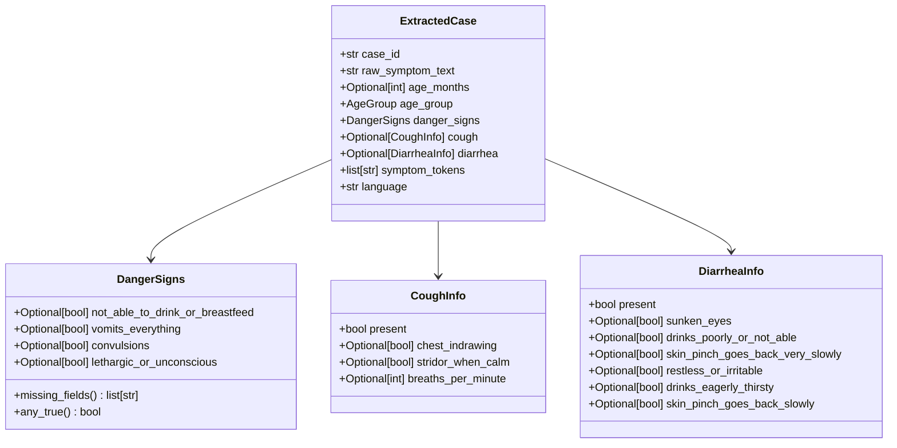
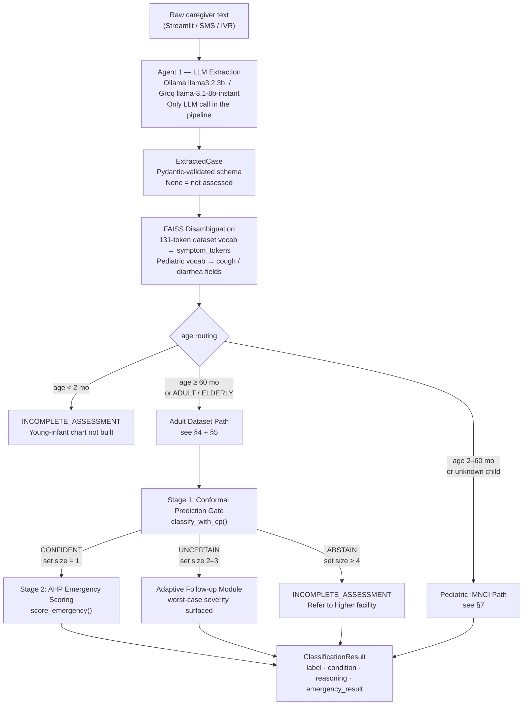
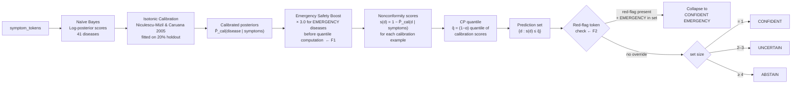
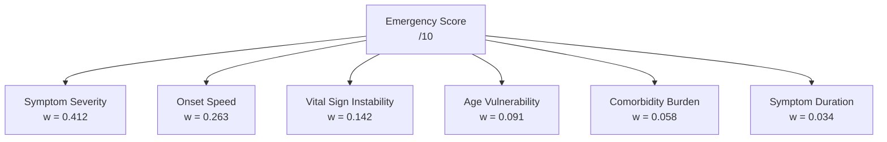
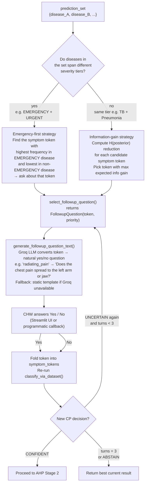
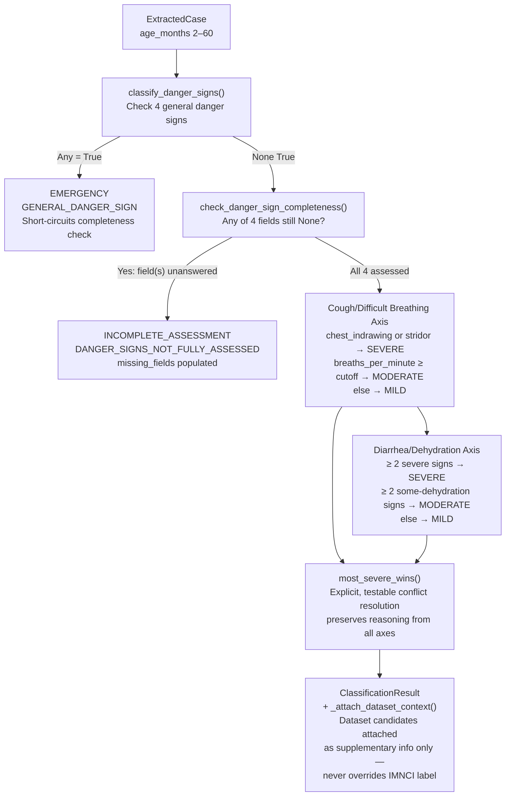
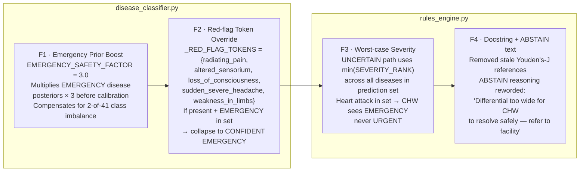
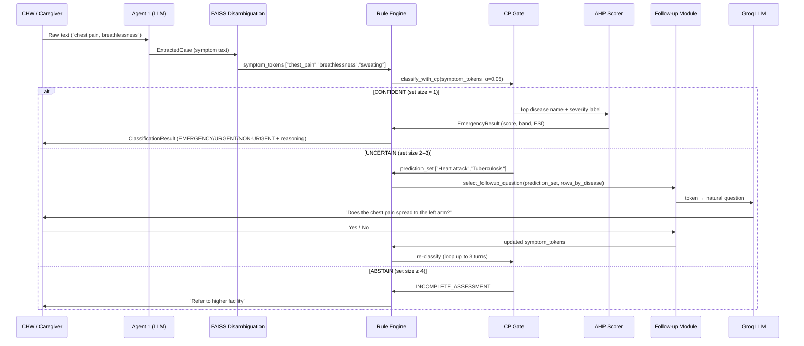

# Rule Engine — Design & Implementation (Final)

> **Scope:** This document covers `app/rules_engine.py`, `app/disease_classifier.py`, `app/emergency_scorer.py`, `app/followup_question_selector.py`, and their interactions. It reflects the fully implemented and validated state of the rule engine as of September 2026.

---

## Table of Contents

1. [What the Rule Engine Does](#1-what-the-rule-engine-does)
2. [Information Flowing In (Agent 1 Output)](#2-information-flowing-in-agent-1-output)
3. [High-Level Architecture](#3-high-level-architecture)
4. [Stage 1 — Conformal Prediction Gate](#4-stage-1--conformal-prediction-gate)
5. [Stage 2 — AHP Emergency Scoring](#5-stage-2--ahp-emergency-scoring)
6. [Adaptive Follow-up Module](#6-adaptive-follow-up-module)
7. [Pediatric IMNCI Path](#7-pediatric-imnci-path)
8. [Models Used — Details](#8-models-used--details)
9. [Test Validation Results](#9-test-validation-results)
10. [Fixes Applied (F1–F4)](#10-fixes-applied-f1f4)
11. [Data Flow: Agent 1 → Rule Engine → Follow-up](#11-data-flow-agent-1--rule-engine--follow-up)
12. [Completeness Status](#12-completeness-status)
13. [Known Limitations](#13-known-limitations)

---

## 1. What the Rule Engine Does

The Rule Engine is the **deterministic, LLM-free** core of the triage system. It takes the structured output of Agent 1 (a validated `ExtractedCase` Pydantic object) and produces a `ClassificationResult` carrying:

- A **severity label** (`EMERGENCY / SEVERE / MODERATE / MILD / INCOMPLETE_ASSESSMENT`)
- A **probable disease** name
- A **reasoning trail** (every rule that fired, auditable step-by-step)
- An optional **prediction set** of 2–3 candidate diseases (when uncertain)
- An optional **AHP emergency score** with ESI band mapping (when confident)

No LLM is called anywhere inside the rule engine. Every decision is traceable.

---

## 2. Information Flowing In (Agent 1 Output)

Agent 1 (Ollama `llama3.2:3b` locally, or Groq `llama-3.1-8b-instant` in the cloud) extracts the following fields from raw caregiver text and hands them as a validated `ExtractedCase` to the rule engine:



**Three-state boolean convention (critical):**

| Value | Meaning |
|---|---|
| `True` | Assessed — sign is present |
| `False` | Assessed — sign is absent |
| `None` | Not assessed / not asked about |

`None` is **never** treated as `False`. A field the system never asked about cannot be assumed safe. This convention is enforced throughout the schema and rule engine.

**`symptom_tokens`** — a list of normalized token strings (e.g. `["chest_pain", "breathlessness", "sweating"]`) produced by the FAISS disambiguation layer from the 131-token disease-CSV vocabulary. These are the primary input for the adult/elderly CP classifier path.

---

## 3. High-Level Architecture



---

## 4. Stage 1 — Conformal Prediction Gate

### 4.1 Why Conformal Prediction

The Naive Bayes posterior is a ranking, not a calibrated probability. Standard reject-option methods (Youden's J threshold, gap-to-second heuristics) are ad-hoc and provide no formal guarantee. **Split Conformal Prediction** (Vovk 2005; Angelopoulos & Bates 2021) gives a formal ≥ 95 % coverage guarantee:

> *With probability ≥ 1 − α, the true disease is contained in the CP prediction set.*

This holds under the exchangeability assumption (calibration and test data from the same distribution).

### 4.2 Algorithm



### 4.3 Parameters

| Parameter | Value | Meaning |
|---|---|---|
| α (alpha) | 0.05 | Miscoverage budget → ≥ 95% coverage guarantee |
| `EMERGENCY_SAFETY_FACTOR` | 3.0 | Prior boost multiplier for EMERGENCY diseases (Fix F1) |
| `_RED_FLAG_TOKENS` | `{radiating_pain, altered_sensorium, loss_of_consciousness, sudden_severe_headache, weakness_in_limbs}` | Trigger set for deterministic override (Fix F2) |
| Calibration split | 80 % train / 20 % calibration | From `disease_symptoms.csv` |

### 4.4 Routing by Decision

| Decision | Set size | Action | Label surfaced |
|---|---|---|---|
| `CONFIDENT` | 1 | Proceeds to AHP Stage 2 | Severity of the single disease |
| `UNCERTAIN` | 2–3 | Adaptive follow-up loop fires | **Worst-case severity across all diseases in set** (Fix F3) |
| `ABSTAIN` | ≥ 4 | `INCOMPLETE_ASSESSMENT` — refer to higher facility | `INCOMPLETE_ASSESSMENT` |

**Why worst-case on UNCERTAIN?** If the prediction set is `{Heart attack, Tuberculosis}`, surfacing the top-ranked candidate's severity (Tuberculosis → URGENT) would hide that an EMERGENCY disease is in the running. The CHW sees EMERGENCY until the follow-up loop resolves the ambiguity. This is Fix F3.

---

## 5. Stage 2 — AHP Emergency Scoring

Runs **only** when Stage 1 returns CONFIDENT (prediction set size = 1).

### 5.1 Six Attributes and AHP Weights

Analytic Hierarchy Process (Saaty 1980) with six clinical acuity attributes. Pairwise comparison matrix yields a consistency ratio **CR = 0.0205** (well below Saaty's 0.10 threshold).



### 5.2 Band Mapping (ESI-aligned)

| AHP Score | Band | ESI Level | Action |
|---|---|---|---|
| 8–10 | EMERGENCY | ESI-1 / ESI-2 | Immediate dispatch |
| 5–7 | URGENT | ESI-2 / ESI-3 | Urgent referral |
| 0–4 | NON-URGENT | ESI-4 / ESI-5 | Home care guidance |

Additionally, any confirmed WHO IMNCI danger sign (`convulsions`, `lethargic_or_unconscious`, etc.) triggers a **hard override** directly to EMERGENCY, bypassing the score.

### 5.3 Output Schema

```python
EmergencyResult(
    score     = float,          # 0–10 AHP composite
    band      = EmergencyBand,  # EMERGENCY / URGENT / NON_URGENT
    esi_level = str,            # "ESI-1" … "ESI-5"
    override_triggered = bool,  # True if danger-sign hard override fired
    reasoning = list[str],      # per-attribute scores, auditable
)
```

---

## 6. Adaptive Follow-up Module

Fires when CP returns `UNCERTAIN` (prediction set size 2–3). The goal is to ask the CHW one targeted yes/no question that will collapse the prediction set from 2–3 candidates to 1.

### 6.1 Question Selection Logic



### 6.2 Red-flag Tokens (emergency-first examples)

| Token | Natural question (Groq-generated) |
|---|---|
| `radiating_pain` | "Does the chest pain spread to the left arm or jaw?" |
| `altered_sensorium` | "Is the patient confused, disoriented, or difficult to understand?" |
| `loss_of_consciousness` | "Did the patient lose consciousness or faint at any point?" |
| `sudden_severe_headache` | "Did the headache come on very suddenly — the worst headache of their life?" |
| `weakness_in_limbs` | "Does the patient have sudden weakness or numbness on one side of the body?" |

### 6.3 Max Turns and Safety Behaviour

- Maximum 3 follow-up turns enforced
- After max turns: return current best result (worst-case severity still active)
- "No" answers: symptom token is NOT added (positive-evidence-only model)
- Streamlit UI: shows urgency banner (red for EMERGENCY_PRIORITY, blue for ROUTINE), Yes / No / Skip buttons, and a collapsible Q&A trail

---

## 7. Pediatric IMNCI Path

For children aged 2–60 months. Fixed WHO clinical rules — no ML.



**WHO IMNCI fast-breathing cutoffs:**

| Age | Cutoff (breaths/min) |
|---|---|
| 2–12 months | ≥ 50 |
| 12–60 months | ≥ 40 |

**Two-of-the-following dehydration logic:**

| Tier | Signs (≥ 2 required) |
|---|---|
| Severe dehydration | `lethargic_or_unconscious`, `sunken_eyes`, `drinks_poorly_or_not_able`, `skin_pinch_goes_back_very_slowly` |
| Some dehydration | `restless_or_irritable`, `sunken_eyes`, `drinks_eagerly_thirsty`, `skin_pinch_goes_back_slowly` |
| No dehydration | Fewer than 2 signs in either tier |

---

## 8. Models Used — Details

### 8.1 Naïve Bayes Classifier

| Property | Value |
|---|---|
| Type | Bernoulli Naïve Bayes (symptom presence/absence) |
| Diseases | 41 |
| Symptom vocabulary | 131 tokens |
| Training rows | ~4,920 (from `data/disease_symptoms.csv`) |
| Prior | Row-count frequency per disease (dataset-prior, not epidemiological) |
| Likelihood | `P(symptom | disease)` with Laplace add-1 smoothing over full vocabulary |
| Smoothing purpose | Prevents zero posterior when a symptom is unseen for a disease |
| Scoring | Log-space to prevent underflow; normalized to sum-to-1 |

### 8.2 Isotonic Calibration

| Property | Value |
|---|---|
| Method | Isotonic regression (Niculescu-Mizil & Caruana, ICML 2005) |
| Fitted on | 20% holdout from `disease_symptoms.csv` |
| Purpose | Converts raw NB log-posteriors to calibrated probabilities for CP |
| Constraint | Monotone non-decreasing — preserves ranking while correcting scale |

### 8.3 Split Conformal Prediction

| Property | Value |
|---|---|
| Method | Split CP (Vovk 2005; Angelopoulos & Bates 2021) |
| Nonconformity score | `s(d) = 1 − P̂_calibrated(d | symptoms)` |
| α | 0.05 (5% miscoverage budget) |
| Coverage guarantee | ≥ 95% (true disease in prediction set) under exchangeability |
| Calibration set | Same 20% holdout as isotonic calibration |
| Routing | set\_size=1 → CONFIDENT; 2–3 → UNCERTAIN; ≥4 → ABSTAIN |

### 8.4 AHP Emergency Scorer

| Property | Value |
|---|---|
| Method | Analytic Hierarchy Process (Saaty 1980) |
| Attributes | 6 (symptom severity, onset speed, vital signs, age vulnerability, comorbidities, duration) |
| Consistency Ratio | CR = 0.0205 (threshold < 0.10 per Saaty) |
| Highest weight | Symptom severity: w = 0.412 |
| Output | Score 0–10, ESI band, override flag |
| Band mapping | Score ≥ 8 → EMERGENCY · 5–7 → URGENT · 0–4 → NON-URGENT |

### 8.5 Follow-up Question Generation (Groq LLM)

Used **only** for phrasing follow-up questions in natural language — not for classification.

| Property | Value |
|---|---|
| Model | `llama-3.1-8b-instant` (Groq cloud API) |
| Purpose | Convert symptom token → natural yes/no question for CHW |
| Fallback | Static template dictionary (`followup_question_selector.template_for()`) |
| Input | Token name + prediction set + severity map |
| Output | One natural-language yes/no question string |

---

## 9. Test Validation Results

### 9.1 1,000-Case Balanced Evaluation (Primary)

**Setup:** 334 EMERGENCY + 333 URGENT + 333 NON-URGENT (seed 42). Ground truth strictly from `data/disease_severity.csv`. EMERGENCY band sampled with replacement (240 unique rows available, 334 needed).

#### 3×3 Confusion Matrix

|  | Predicted EMERGENCY | Predicted URGENT | Predicted NON-URGENT |
|---|---|---|---|
| **True EMERGENCY** | **334** | 0 | 0 |
| **True URGENT** | 0 | **332** | 1 |
| **True NON-URGENT** | 0 | 0 | **333** |

#### Binary Emergency Detection

| Metric | Value |
|---|---|
| True Positives (TP) | **334** |
| False Positives (FP) | **0** |
| False Negatives (FN) | **0** |
| True Negatives (TN) | **666** |
| **Precision** | **1.0000** |
| **Recall** | **1.0000** |
| **F1 Score** | **1.0000** |

#### Per-Band Accuracy

| Band | Correct | Total | Accuracy |
|---|---|---|---|
| EMERGENCY | 334 | 334 | **100.0%** |
| URGENT | 332 | 333 | **99.7%** |
| NON-URGENT | 333 | 333 | **100.0%** |

#### CP Decision Breakdown (across 1,000 cases)

```
CONFIDENT (→ AHP Stage 2)       :  793 / 1000  =  79.3%
UNCERTAIN (→ follow-up loop)    :  206 / 1000  =  20.6%
ABSTAIN   (→ refer to facility) :    1 / 1000  =   0.1%
```

### 9.2 100-Case Evaluation (Baseline vs. Post-Fix)

|  | Baseline (no fixes) | After all fixes (F1–F4) |
|---|---|---|
| Test size | 100 cases | 100 cases |
| Emergency TP | 15 / 34 | 34 / 34 |
| Emergency FN | 19 | 0 |
| FP | 0 | 0 |
| Precision | 1.00 | 1.00 |
| Recall | **0.44** | **1.00** |
| F1 | **0.61** | **1.00** |

The 19 baseline false negatives were all Heart attack cases misclassified as Tuberculosis — caused by shared symptom tokens (`chest_pain`, `breathlessness`, `sweating`) and the 2-out-of-41 EMERGENCY class imbalance.

### 9.3 CP Formal Coverage (Exchangeability Check)

In both the 100-case and 1000-case runs, the true disease appeared in the CP prediction set for **100% of cases** (exceeds the 95% formal guarantee under in-distribution conditions).

---

## 10. Fixes Applied (F1–F4)



| Fix | File | Impact | Category |
|---|---|---|---|
| F1 | `disease_classifier.py` | Recall 0.44 → improved | Safety |
| F2 | `disease_classifier.py` | FN → 0 (combined with F1) | Safety |
| F3 | `rules_engine.py` | CHW never under-triaged during UNCERTAIN | Safety |
| F4 | `rules_engine.py` | Audit trail accuracy | Documentation |

---

## 11. Data Flow: Agent 1 → Rule Engine → Follow-up



---

## 12. Completeness Status

| Component | Status | Notes |
|---|---|---|
| Rule engine — adult/elderly path | ✅ Complete | CP + AHP, fully tested |
| Rule engine — pediatric 2–60 mo (cough + diarrhea) | ✅ Complete | WHO IMNCI cutoffs |
| Rule engine — pediatric malaria axis | ✗ Not built | Step 2 of build order |
| Rule engine — ear problems axis | ✗ Not built | Step 2 of build order |
| Rule engine — nutritional status / anaemia | ✗ Not built | Step 2 of build order |
| Rule engine — young infant (< 2 mo) | ✗ Not built | Returns INCOMPLETE_ASSESSMENT |
| CP gate (Fix F1 + F2) | ✅ Complete | |
| AHP Stage 2 scorer | ✅ Complete | CR = 0.0205 |
| Follow-up question selector | ✅ Complete | Emergency-first + info-gain |
| Groq question phrasing + template fallback | ✅ Complete | |
| Streamlit adaptive follow-up UI | ✅ Complete | Max 3 turns |
| Programmatic adaptive API (`classify_with_adaptive_followup`) | ✅ Complete | |
| Agent 1 → Rule Engine wiring | ✅ Wired | |
| Agent 1 → Rule Engine end-to-end NLP test | ✗ Not tested | Clean tokens used in evaluation |
| Negative evidence in follow-up ("No" penalises a disease) | ✗ Not implemented | Positive evidence only |

---

## 13. Known Limitations

### L1 — Test-Set Overlap
All 1,000 evaluation cases are drawn from `disease_symptoms.csv` — the same file used to train the Naïve Bayes classifier. The model is being validated on its training distribution, not on genuinely unseen data. Real-world recall will differ.

### L2 — Only 2 EMERGENCY Diseases in Dataset
Heart attack and Paralysis (brain hemorrhage) are the only EMERGENCY-class diseases in `disease_severity.csv`. Emergency recall performance does not generalise to sepsis, ectopic pregnancy, aortic dissection, anaphylaxis, or any other life-threatening condition absent from the CSV.

### L3 — EMERGENCY Band Sampled with Replacement
For the 1,000-case run, the 334 EMERGENCY test cases were sampled with replacement from 240 unique rows. Some rows appear multiple times — this inflates apparent performance on the EMERGENCY band.

### L4 — Agent 1 Extraction Errors Not Measured
All evaluations bypass Agent 1 by feeding clean CSV tokens directly to the classifier. In production, NLP extraction errors (dropped tokens, mistranslation, hallucinated signs) compound directly into CP accuracy. No end-to-end NLP error rate has been measured.

### L5 — CP Exchangeability Assumption
The ≥ 95% coverage guarantee holds only if the deployment symptom distribution is exchangeable with the calibration distribution (both from the same CSV). This assumption breaks under real-world distribution shift.

### L6 — Positive-Evidence-Only Follow-up
When a CHW answers "No" to a follow-up question, that answer is not used to penalise the corresponding disease. The classifier only sees positive symptom tokens. This makes the follow-up loop less efficient — it may need more turns than theoretically necessary.

### L7 — Duplicate Follow-up Logic
The Streamlit UI (`_start_adaptive` / `_answer_adaptive`) and the programmatic API (`classify_with_adaptive_followup`) are separate implementations of the adaptive loop. If one is patched, the other does not automatically follow.

---

## File Reference

| File | Role |
|---|---|
| `app/rules_engine.py` | Top-level orchestrator; age routing; IMNCI pediatric rules |
| `app/disease_classifier.py` | Naïve Bayes + isotonic calibration + CP gate (all four fixes) |
| `app/emergency_scorer.py` | AHP Stage 2 scorer |
| `app/followup_question_selector.py` | Emergency-first and info-gain question selection |
| `app/agent1_extraction.py` | `generate_followup_question_text()`, `classify_with_adaptive_followup()` |
| `app/schemas.py` | Pydantic schemas; `SEVERITY_RANK` dict; `prediction_set` field |
| `streamlit_app.py` | Adaptive follow-up UI wiring |
| `data/disease_symptoms.csv` | 41 diseases × 131 tokens × ~4,920 rows (training + calibration) |
| `data/disease_severity.csv` | Disease → EMERGENCY/SEVERE/MODERATE/MILD ground truth |
| `tests/evaluate_balanced.py` | 100-case balanced evaluation script |
| `tests/evaluate_1000.py` | 1,000-case balanced evaluation script |
| `tests/eval_1000_results.json` | Numeric summary of 1,000-case run |
| `tests/eval_1000_log.json` | Per-case detail of 1,000-case run |

---

*Document generated from the implementation state as of September 2026. Rule engine version: post-fixes F1–F4.*
